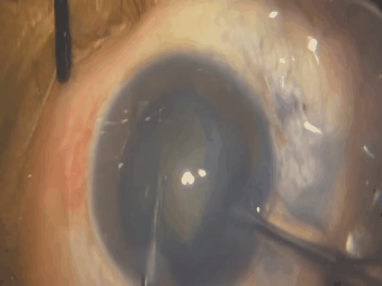
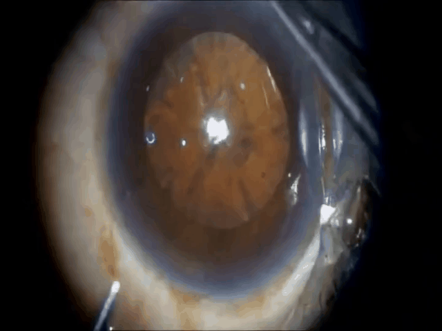
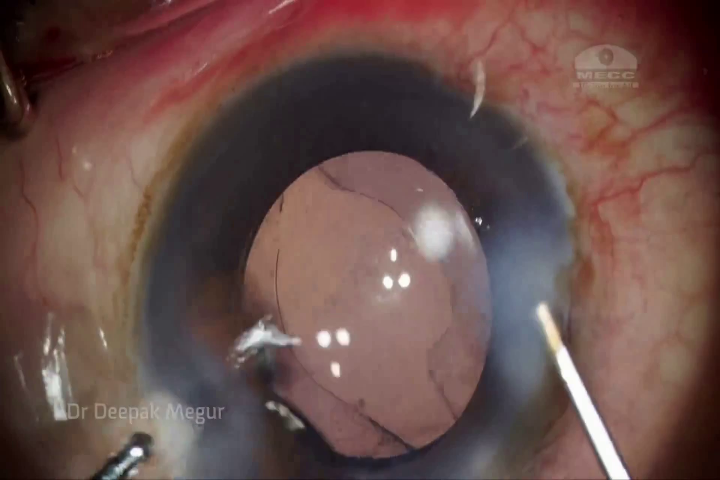
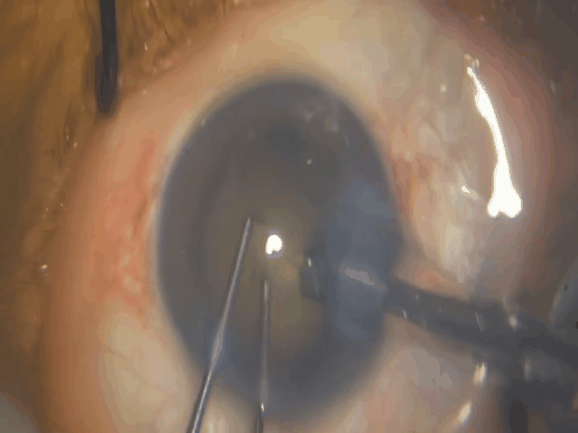
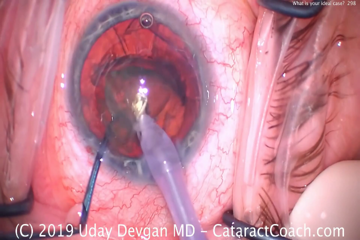
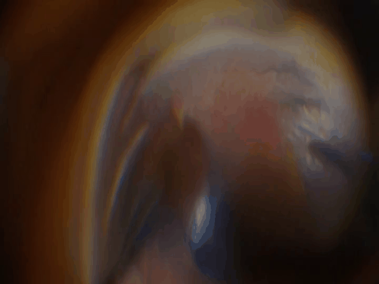
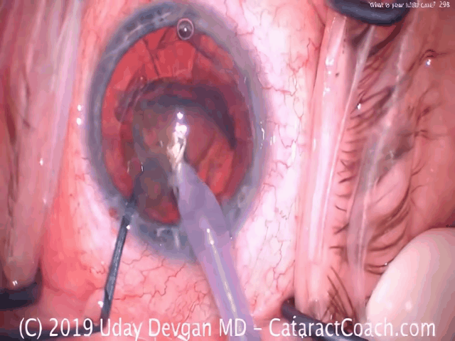
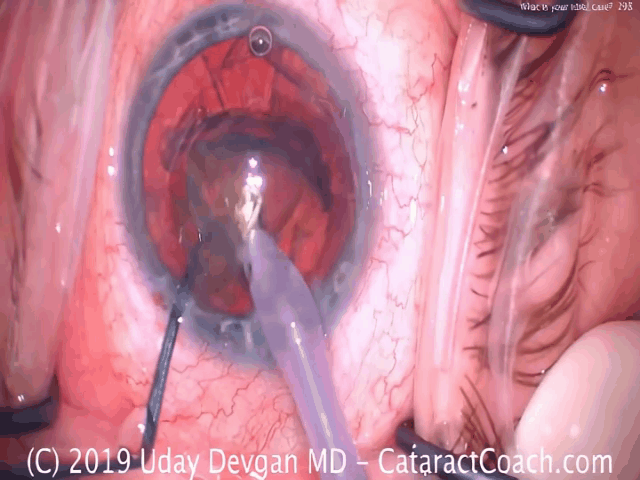

# OphReFlow

## Overview

This is the **official repository** for **OphReFlow** - a motion-aware framework for generating high-quality surgical videos.

> **📢 Status:** This repository is currently in preparation. Upon formal acceptance of our research paper, we will open-source the complete code and resources to the community.

### About OphReFlow

OphReFlow is a text-image-to-video (TI2V) framework designed for surgical video generation with improved temporal coherence and visual quality. Unlike traditional text-to-video approaches that suffer from scene templating and limited visual diversity, OphReFlow explicitly models inter-frame motion dynamics to maintain coherent motion and structural consistency across frames.

## Qualitative Comparisons

|Input Image | Prompt | Ophora |  Hunyuan Video-1.5 | OphReFlow |
|---|---|---|---|---|
|  | Show the surgical steps and techniques for maintaining the posterior capsule's integrity, including instrument handling and maneuvers. |  |  |  |
|  | Explore and remove dislocated lens fragments using microsurgical tools and specialized forceps, navigating carefully around ocular anatomy. |  |  |  |
|  | Create a video demonstrating the process of performing a retinectomy, including the step of making a break in the retina. |  |  |  |

> **Note:** Ophora is a text-to-video (T2V) generation method without image conditioning, whereas HunyuanVideo and OphReFlow are text-image-to-video (TI2V) methods conditioned on the same input image shown in the first column.
